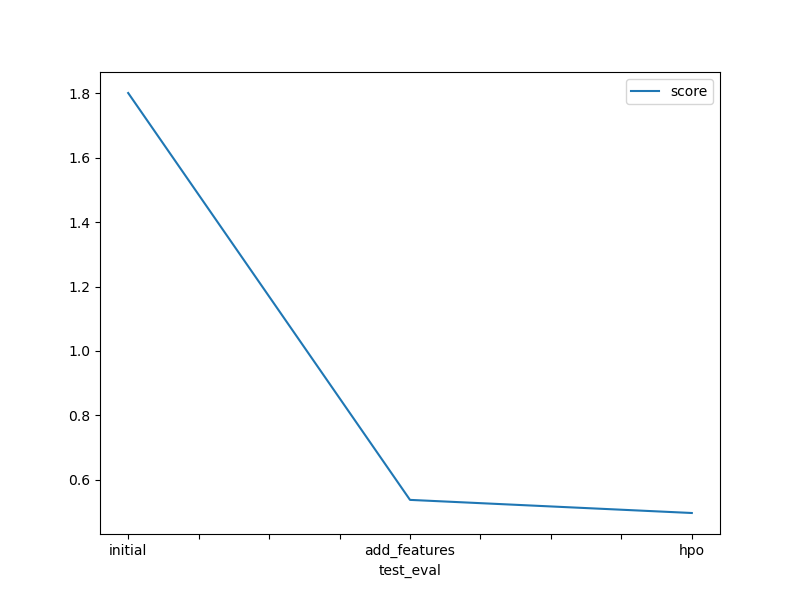

# Report: Predict Bike Sharing Demand with AutoGluon Solution
#### Emran Ali (wwmemran) 

## Initial Training
### What did you realize when you tried to submit your predictions? What changes were needed to the output of the predictor to submit your results?
Predictions need to be non-negative. So, the non-negative values are changed to zero.  

### What was the top-ranked model that performed?
'WeightedEnsemble_L3' was found to be the top-ranked model and the score was 1.80153. 

## Exploratory data analysis (EDA) and feature creation
### What did the exploratory analysis find and how did you add additional features?
EDA helped find the distribution and relationship among features and target variable. The 'datetime' information was not so useful in its original form, thus the individual components of 'datetime' feature were extracted to make the data more meaningful. In the same way, additional features were extracted as 'daypart', 'temptype', 'windtype' and 'humidtype' from 'day', 'temp', 'windspeed' and 'humidity'. Additionally, some categorical features ('season', 'weather', 'daypart', 'temptype', 'windtype' and 'humidtype') that were in numeric form were converted to 'category' since there is no ordering information in those categorical features. 

### How much better did your model perform after adding additional features and why do you think that is?
The model's performance was elevated from a score of 1.80153 to 0.53680, which is a significant improvement. I think it happened because the features became more meaningful and the model was able to find a relationship/trend between the features and the target variable. 

## Hyperparameter tuning
### How much better did your model perform after trying different hyperparameters?
After the hyperparameter tuning model's performance was again improved, from 0.53680 to 0.49603. I believe the choice of hyperparameter was good even though they were all default parameters in AutoGluon, and that could be observed more. 

### Why did hyperparameters affect the outcome of the model's performance?
After the hyperparameter tuning model's performance was again improved, and this was because with default parameters model might not work to its best. When the hyperparameters are tuned then from a range of values the model had the option to choose from those values, and at least one of them are expected to do better. 

### If you were given more time with this dataset, where do you think you would spend more time?
I think, I would spend a bit more on preprocessing and then a lot on hyperparameter tuning. 

### Create a table with the models you ran, the hyperparameters modified, and the kaggle score.
|model|WeightedEnsemble_L3|ExtraTrees_BAG_L1|LightGBM_BAG_L1/T2|score|
|--|--|--|--|--|
|initial|'default'|'default'|'default'|1.80153|
|add_features|'default'|'default'|'default'|0.5368|
|hpo|{'use_orig_features': False, 'max_base_models': 25, 'max_base_models_per_type': 5, 'save_bag_folds': True}|{'use_orig_features': True, 'max_base_models': 25, 'max_base_models_per_type': 5, 'save_bag_folds': True, 'use_child_oof': True}|{'use_orig_features': True, 'max_base_models': 25, 'max_base_models_per_type': 5, 'save_bag_folds': True}|0.49603|

### Create a line plot showing the top model score for the three (or more) training runs during the project.

TODO: Replace the image below with your own.

### Create a line plot showing the top Kaggle score for the three (or more) prediction submissions during the project.

TODO: Replace the image below with your own.

## Summary
TODO: Add your explanation
